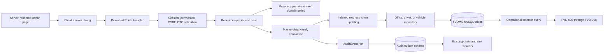

# Feature: Manage office, driver, and vehicle master data safely

The following plan is complete, but validate installed Next.js documentation, current codebase patterns, and task sanity before implementation.

Pay special attention to separate domain models, database-enforced uniqueness, explicit soft-delete reads, transaction-scoped audit capture, personal-data redaction, and permission-aware selectors.

## Feature Description

FVD-004 delivers the reference data required by later budget, fuel, and dispatch workflows. It adds complete administration for offices, drivers, and vehicles, including creation, editing, operational status changes, soft deletion, restoration, filtered lists, and bounded operational selectors.

The three resources remain separate domain modules. They share only transport, transaction, pagination, audit, and presentation mechanics where those mechanics carry no resource-specific business rules.

Every mutation uses the authenticated principal, opaque public identifiers, Cross-Site Request Forgery protection, server-side authorization, and one MySQL transaction. The transaction persists the business change and its immutable audit outbox event together.

## User Story

As a System Administrator,
I want to maintain offices, drivers, and vehicles through controlled lifecycle workflows,
so that fuel and dispatch users select accurate reference data without losing historical records.

## Problem Statement

FVDMS now has secure authentication, role-based access control, and durable audit capture. It does not yet have the reference aggregates required by budget allocation, fuel issuance, or vehicle dispatch.

Uncontrolled CRUD would create several risks. Concurrent requests could duplicate offices or plate numbers. Physical deletion could break historical references. Restoring a deleted driver or vehicle could make it operational without review. Driver contact numbers could leak through selectors, logs, or immutable audit snapshots.

## Solution Statement

Create separate `office`, `driver`, and `vehicle` domain and application modules. Each module owns its value objects, lifecycle invariants, data transfer objects, repository port, and use cases.

Add one reversible migration for the three normalized tables and three read permissions. Database unique constraints remain the final authority under concurrency. Application normalization and field-level conflict mapping provide predictable user feedback.

Implement resource-specific Kysely repositories behind one master-data transaction seam. Default reads exclude deleted rows. Historical reads use explicit including-deleted methods. Operational selectors additionally require `ACTIVE` offices, `ACTIVE` drivers, or `SERVICEABLE` vehicles.

Build server-rendered administration pages with client-only form and dialog leaves. Reuse shared presentation primitives for filters, pagination, responsive results, status badges, and lifecycle confirmation. Do not introduce a generic master-data entity, repository, form schema, or mutation engine.

## Out of Scope / Non-Goals

- Not included: budget allocation lifecycle. FVD-005 consumes office references.
- Not included: fuel issuance or balance workflows. FVD-006 consumes driver and vehicle selectors.
- Not included: dispatch scheduling, availability calendars, conflict detection, or overrides. FVD-007 and FVD-008 own those rules.
- Not included: Redis reference-data caching. The architecture marks caching as a later P2 optimization.
- Not included: offline mutation queues, synchronization, or selector persistence. FVD-010 owns offline behavior.
- Not included: bulk import, export, merge, deduplication, or physical purge workflows.
- Not included: Philippine plate-format validation. Normalize case and whitespace, but preserve punctuation.
- Not included: international phone-number validation. Treat contact numbers as optional bounded personal data.
- Not included: a new dashboard shell, sidebar redesign, or grouped client navigation menu.
- Not changing: the shared Docker, Traefik, dnsmasq, `dev-net`, MySQL, or `https://fvdms.lan` development topology.
- Not changing: authentication cookies, session rules, CSRF controls, audit hash-chain workers, or audit verification.
- Not using: hard delete, sequential identifiers in APIs, unbounded collections, generic `delete()`, generic domain inheritance, or client-authoritative lifecycle rules.

## Feature Metadata

**Feature Type**: New Capability

**Estimated Complexity**: High

**Primary Systems Affected**: Office, driver, and vehicle domains; application use cases; Kysely/MySQL persistence; permissions; durable audit outbox; Next.js Route Handlers; protected administration pages; shared presentation primitives; Vitest; MySQL Testcontainers; Playwright; axe

**Dependencies**: FVD-003; Next.js 16.3.3; React 19.2.8; Kysely 0.29.5; MySQL 8.4; Zod 4.4.3; React Hook Form 7.86.0; `@hookform/resolvers` 5.9.1; shadcn/ui new-york; `@radix-ui/react-dialog` 1.1.23; existing Radix AlertDialog; Lucide; Vitest 4.1.11; Playwright 1.62.1; axe 4.13.0

## Confirmed Ticket-Level Decisions

The user accepted all recommended defaults on 2026-08-28.

- Add `office.read`, `driver.read`, and `vehicle.read` permissions.
- `SUPER_ADMIN` and `SYSTEM_ADMIN` read and manage all three resources.
- `PSMD_STAFF` and `DISPATCH_OFFICER` read drivers and vehicles.
- `BUDGET_OFFICER` reads offices.
- `VIEWER` and `AUDITOR` read all three resources without management access.
- Each `*.manage` permission satisfies the matching read requirement even when a custom role lacks `*.read`.
- New offices and drivers start `ACTIVE`. New vehicles start `SERVICEABLE`.
- Restored offices and drivers become `INACTIVE`. Restored vehicles become `UNSERVICEABLE`.
- Restoration never places a record directly into an operational selector.
- Normalize names, abbreviations, and plates by trimming and collapsing internal whitespace.
- Store office abbreviations and plate numbers in uppercase.
- Preserve punctuation in plate numbers.
- Keep unique values reserved while rows are soft-deleted.
- Only `driver.manage` responses expose full driver contact numbers.
- Operational selectors and read-only responses omit driver contact numbers.
- Logs never contain contact numbers. Audit events record only presence or change markers.
- Use `GET /api/{resource}?mode=operational` for selectors instead of `/options` routes.
- Use opaque cursor pagination with API default 50, API maximum 200, and administration page size 25.
- Use three direct permission-filtered administration links.
- Create records in accessible dialogs. Edit and lifecycle actions live on detail pages.
- Share presentation primitives only. Keep domain models and resource validation separate.

## Related Work

**Implements**: FVD-004 in `docs/tickets/fuel-and-vehicle-dispatch-system.md:124`

**Epic**: `docs/PRD.md`

**Inherited architecture**: `docs/System_Architecture.md`

**Back-references**

- `.claude/plans/bootstrap-secure-application-foundation.md` - Establishes Clean Architecture, Kysely/MySQL, public IDs, validation, Docker, and design-system decisions.
- `.claude/plans/deliver-authentication-sessions-rbac.md` - Establishes principals, permissions, sessions, CSRF, authorization denial evidence, route helpers, and protected administration patterns.
- `.claude/plans/establish-durable-immutable-audit-capture-verification.md` - Establishes `AuditEventPort`, transaction-scoped outbox capture, immutable chain processing, audit search, and verification.
- `design-system/fuel-and-vehicle-dispatch-management-system/MASTER.md` - Governs visual, responsive, and accessibility behavior.
- [Pull request #2](https://github.com/JSON-FX/fuel-and-vehicle-dispatch-management-system/pull/2) - Contains the FVD-003 audit dependency and is open at planning time.

**Forward-references**

- FVD-005 will use current and including-deleted office lookups for budget allocations.
- FVD-006 will use operational driver and vehicle selectors for fuel issuance.
- FVD-007 will enforce driver activity and vehicle serviceability when creating dispatches.
- FVD-008 will add availability, schedule conflicts, and controlled overrides.
- FVD-010 will add bounded offline reference caches and synchronization.

---

## CONTEXT REFERENCES

### Relevant Codebase Files IMPORTANT: YOU MUST READ THESE FILES BEFORE IMPLEMENTING

#### Requirements and binding architecture

- `docs/tickets/fuel-and-vehicle-dispatch-system.md:124` - Defines FVD-004 scope, acceptance criteria, seams, and the prohibition on a generic domain model.
- `docs/tickets/fuel-and-vehicle-dispatch-system.md:154` - Makes FVD-003 a hard dependency.
- `docs/PRD.md:341` - Defines office fields and unique name and abbreviation requirements.
- `docs/PRD.md:353` - Defines vehicle fields and unique plate requirement.
- `docs/PRD.md:367` - Defines driver fields.
- `docs/PRD.md:399` - Defines minimum immutable audit event content.
- `docs/PRD.md:417` - Defines soft deletion, historical preservation, actor, reason, and restoration requirements.
- `docs/PRD.md:573` - Requires prompt interactive CRUD and bounded collections.
- `docs/PRD.md:581` - Requires keyboard access, visible focus, labels, contrast, and accessible errors.
- `docs/PRD.md:589` - Requires database constraints, application validation, and transactions together.
- `docs/PRD.md:609` - Requires object-level authorization and opaque public IDs.
- `docs/PRD.md:615` - Requires CSRF protection on every cookie-authenticated mutation.
- `docs/PRD.md:618` - Classifies driver contact numbers as personal data.
- `docs/PRD.md:680` - Defines normalized master data and soft-delete metadata.
- `docs/PRD.md:715` - Defines the protected API baseline, safe errors, and pagination.
- `docs/PRD.md:823` - Defines defensible, immutable administrative records.
- `docs/PRD.md:983` - Forbids business logic in React, routes, and persistence models.
- `docs/System_Architecture.md:56` - Limits controllers to authentication, authorization, validation, DTO mapping, use-case invocation, and response mapping.
- `docs/System_Architecture.md:205` - Defines office, driver, and vehicle as separate reference aggregates.
- `docs/System_Architecture.md:283` - Defines vehicle serviceability and driver activity as operational eligibility state.
- `docs/System_Architecture.md:362` - Defines the office table and indexes.
- `docs/System_Architecture.md:400` - Defines the driver table.
- `docs/System_Architecture.md:411` - Defines the vehicle table and indexes.
- `docs/System_Architecture.md:555` - Requires audit capture for office, driver-status, and vehicle-status changes.
- `docs/System_Architecture.md:622` - Defines role-based access control and server-side permission enforcement.
- `docs/System_Architecture.md:682` - Defines collection, update, soft-delete, and restore route shapes.
- `docs/System_Architecture.md:761` - Requires explicit soft-delete, restore, current, and including-deleted repository methods.
- `docs/System_Architecture.md:772` - Defines the safe API envelope and forbidden error leakage.
- `docs/System_Architecture.md:795` - Keeps DTOs separate from database rows.
- `docs/System_Architecture.md:820` - Places repository interfaces inward and Kysely implementations in infrastructure.
- `docs/System_Architecture.md:948` - Forbids full personal data in logs.
- `docs/System_Architecture.md:1012` - Defines restrained, professional, data-dense administration pages.
- `docs/System_Architecture.md:1037` - Defines unit, integration, browser, accessibility, and security test responsibilities.
- `docs/System_Architecture.md:1210` - Locks the stack and modular monolith approach.
- `docs/System_Architecture.md:1257` - Defers Redis caching and retains hard list ceilings.
- `design-system/fuel-and-vehicle-dispatch-management-system/MASTER.md:15` - Defines the accuracy-first, semantic, Server Component design principles.
- `design-system/fuel-and-vehicle-dispatch-management-system/MASTER.md:114` - Defines shadcn/Radix component, form-label, and focus behavior.
- `design-system/fuel-and-vehicle-dispatch-management-system/MASTER.md:126` - Defines table density, sticky headers, responsive cards, and explicit states.
- `design-system/fuel-and-vehicle-dispatch-management-system/MASTER.md:136` - Defines responsive breakpoints and 44-pixel targets.
- `design-system/fuel-and-vehicle-dispatch-management-system/MASTER.md:145` - Defines keyboard, zoom, live-region, and reduced-motion checks.

#### Domain, application, and error patterns

- `src/domain/shared/value-objects/public-id.ts:4` - Required UUID public-ID value object.
- `src/domain/shared/errors/domain-error.ts:1` - Domain invariant failure pattern.
- `src/domain/user/value-objects/username.ts:3` - Private constructor, `from()` normalization, validation, and string conversion pattern.
- `src/domain/user/entities/user.ts:16` - Entity-owned lifecycle behavior and safe inactive restoration precedent.
- `src/application/auth/dto/authentication-dtos.ts:1` - Current principal and immutable DTO conventions.
- `src/application/auth/ports/user-repository.ts:26` - Resource-specific application repository interface pattern.
- `src/application/auth/ports/auth-transaction.ts:11` - Transaction-scoped repository and audit-port pattern.
- `src/application/auth/use-cases/update-user.ts:18` - Permission check, clock, transaction, mutation, and audit append pattern.
- `src/application/auth/use-cases/soft-delete-user.ts:22` - Reason validation, lifecycle rules, and atomic deletion evidence pattern.
- `src/application/auth/services/auth-audit-events.ts:26` - Audit event builder and entity-reference pattern.
- `src/application/audit/ports/audit-event-port.ts:1` - Durable audit capture seam.
- `src/application/shared/errors/application-error.ts:19` - Stable validation, authorization, not-found, conflict, business-rule, and persistence errors.

#### Persistence, pagination, and composition patterns

- `src/infrastructure/database/migrations/20260828_000002_create_authentication_and_rbac.ts:9` - Seeded role and permission catalog.
- `src/infrastructure/database/migrations/20260828_000002_create_authentication_and_rbac.ts:46` - Current role assignments that migration 000004 must extend.
- `src/infrastructure/database/migrations/20260828_000003_create_durable_audit_subsystem.ts:246` - Additive permission seeding and reversible assignment pattern.
- `src/infrastructure/database/types.ts:20` - Kysely boolean and timestamp aliases.
- `src/infrastructure/database/types.ts:153` - Central application database type registry.
- `src/infrastructure/database/bootstrap.ts:27` - Current `utf8mb4_0900_ai_ci` database collation.
- `src/infrastructure/database/uuid-binary.ts:7` - Required public UUID and `BINARY(16)` conversion.
- `src/infrastructure/database/auth/kysely-user-repository.ts:95` - Typed update object, current-row filter, and affected-row mapping.
- `src/infrastructure/database/auth/kysely-user-repository.ts:133` - Existing user soft-delete precedent. Do not copy its missing actor and reason fields.
- `src/infrastructure/database/auth/kysely-rate-limit-repository.ts:60` - Duplicate-key detection and retry precedent.
- `src/infrastructure/database/auth/kysely-auth-transaction.ts:14` - Kysely callback transaction adapter.
- `src/infrastructure/database/audit/kysely-audit-outbox-store.ts:53` - Transaction-compatible immutable outbox implementation.
- `src/infrastructure/database/audit/audit-cursor-codec.ts:15` - Versioned base64url cursor and filter-fingerprint pattern.
- `src/infrastructure/database/audit/kysely-audit-query-repository.ts:65` - Keyset direction, `pageSize + 1`, cursor generation, and reversal pattern.
- `src/infrastructure/composition/audit.ts:46` - Feature-specific composition module pattern.
- `src/infrastructure/composition/root.ts:55` - Root composition contract and explicit use-case exposure.
- `src/infrastructure/composition/root.ts:104` - Shared dependency construction and frozen composition pattern.

#### HTTP and authorization patterns

- `src/lib/auth/authenticated-request.ts:43` - Session authentication, permission checks, and denial evidence.
- `src/lib/auth/authenticated-request.ts:72` - Bounded IP and user-agent audit context extraction.
- `src/lib/auth/route-helpers.ts:19` - JSON content type, origin, and CSRF mutation protection.
- `src/lib/auth/route-schemas.ts:3` - Public ID and 10-to-500-character reason schemas.
- `src/lib/http/with-response-handler.ts:24` - Safe envelopes, request IDs, no-store headers, and sanitized failures.
- `src/app/api/users/route.ts:12` - Collection query parsing and authenticated GET/POST route pattern.
- `src/app/api/users/[userId]/route.ts:12` - Async route params, public-ID parsing, PATCH mapping, and protected mutation pattern.
- `src/app/api/users/[userId]/restore/route.ts:1` - Explicit POST restore route precedent.
- `src/lib/audit/route-schemas.ts:3` - Empty native GET value preprocessing.
- `src/lib/audit/page-query.ts:25` - Strict page-query normalization and filter-preserving pagination URL pattern.
- `src/lib/audit/server-audit-access.ts:17` - Server-page authorization denial capture.

#### Presentation patterns

- `src/app/(protected)/layout.tsx:8` - Server-rendered permission-filtered navigation and wrapping shell.
- `src/app/(protected)/admin/users/page.tsx:19` - Protected Server Component list, native GET filter, responsive table/cards, and create action.
- `src/app/(protected)/admin/users/[userId]/page.tsx:14` - Server-rendered detail, edit cards, and lifecycle action layout.
- `src/app/(protected)/audit/page.tsx:24` - Strong invalid-filter, request-error, empty, filtered-empty, denied, and cursor-state handling.
- `src/components/audit/audit-filter-form.tsx:28` - Native GET filter form with visible labels.
- `src/components/audit/audit-event-table.tsx:16` - Named scroll region, sticky header, and complete mobile-card pattern.
- `src/components/admin/security-action-dialog.tsx:22` - Pending, error-preserving, CSRF-protected AlertDialog behavior. Do not reuse its always-required reason unchanged for restore.
- `src/components/forms/login-form.tsx:18` - React Hook Form, Zod resolver, field error association, and pending-state pattern.
- `src/components/forms/auth-form-utils.ts:1` - Existing response reader. Preserve it for auth and add a field-detail-aware master-data reader.
- `src/components/ui/alert-dialog.tsx:1` - Existing destructive confirmation primitive.
- `components.json:1` - Binding shadcn new-york, React Server Component, CSS-variable, and import-alias configuration.

#### Testing and local runtime patterns

- `vitest.config.ts:11` - Node unit tests and 80-percent coverage thresholds.
- `vitest.integration.config.ts:11` - Serial MySQL integration suite.
- `tests/integration/helpers/mysql-container.ts:11` - Shared MySQL 8.4 Testcontainer lifecycle.
- `tests/integration/auth/auth-repositories.test.ts:144` - Transaction rollback proof pattern.
- `tests/unit/app/api/users/users-route.test.ts:1` - Route dependency mocking and response assertion pattern.
- `tests/unit/components/audit/audit-components.test.ts:1` - Static presentation component rendering pattern.
- `playwright.config.ts:3` - Serial Chromium browser configuration.
- `tests/e2e/global-setup.ts:30` - Disposable MySQL, migrations, principals, audit worker, and Next.js server setup.
- `tests/e2e/fixtures/auth.ts:4` - Existing administrator, dispatch, viewer, and auditor accounts.
- `tests/e2e/fixtures/axe.ts:1` - Shared axe accessibility assertion.
- `tests/e2e/audit-trail.spec.ts:89` - Keyboard, responsive, dark-scheme, reduced-motion, and overflow checks.
- `compose.yaml:1` - Existing FVDMS app and audit services on external local infrastructure. No FVD-004 Compose change is expected.

### Existing Files to Update

- `package.json` and `pnpm-lock.yaml` - Add exact `@radix-ui/react-dialog@1.1.23` dependency.
- `src/application/shared/errors/application-error.ts` - Preserve safe conflict status while allowing field-level duplicate details.
- `src/infrastructure/database/types.ts` - Register office, driver, and vehicle tables.
- `src/infrastructure/composition/root.ts` - Spread the dedicated master-data web composition.
- `src/app/(protected)/layout.tsx` - Add three manage-only navigation links.
- `tests/e2e/global-setup.ts` - Seed deterministic reference data after migrations.
- `tests/e2e/fixtures/auth.ts` - Reuse or extend role fixtures for permission coverage.
- `tests/e2e/accessibility.spec.ts` - Add populated master-data and open-dialog coverage.
- `README.md` - Document master-data routes, permissions, lifecycle semantics, and local validation.

### New Files to Create

#### Domain modules

- `src/domain/office/entities/office.ts`
- `src/domain/office/value-objects/office-name.ts`
- `src/domain/office/value-objects/office-abbreviation.ts`
- `src/domain/office/value-objects/office-status.ts`
- `src/domain/driver/entities/driver.ts`
- `src/domain/driver/value-objects/driver-name.ts`
- `src/domain/driver/value-objects/driver-contact-number.ts`
- `src/domain/driver/value-objects/driver-status.ts`
- `src/domain/vehicle/entities/vehicle.ts`
- `src/domain/vehicle/value-objects/model-brand.ts`
- `src/domain/vehicle/value-objects/vehicle-type.ts`
- `src/domain/vehicle/value-objects/plate-number.ts`
- `src/domain/vehicle/value-objects/vehicle-status.ts`
- `src/domain/vehicle/value-objects/vehicle-remarks.ts`

#### Application modules

- `src/application/master-data/dto/master-data-list-dtos.ts`
- `src/application/master-data/ports/master-data-transaction.ts`
- `src/application/master-data/services/master-data-audit-events.ts`
- `src/application/master-data/services/master-data-permission-policy.ts`
- `src/application/office/dto/office-dtos.ts`
- `src/application/office/ports/office-repository.ts`
- `src/application/office/use-cases/{create,get,list,list-operational-options,update,soft-delete,restore}-office*.ts`
- `src/application/driver/dto/driver-dtos.ts`
- `src/application/driver/ports/driver-repository.ts`
- `src/application/driver/use-cases/{create,get,list,list-operational-options,update,soft-delete,restore}-driver*.ts`
- `src/application/vehicle/dto/vehicle-dtos.ts`
- `src/application/vehicle/ports/vehicle-repository.ts`
- `src/application/vehicle/use-cases/{create,get,list,list-operational-options,update,soft-delete,restore}-vehicle*.ts`

#### Database and composition

- `src/infrastructure/database/migrations/20260828_000004_create_master_data.ts`
- `src/infrastructure/database/master-data/master-data-cursor-codec.ts`
- `src/infrastructure/database/master-data/master-data-repository-utils.ts`
- `src/infrastructure/database/master-data/kysely-office-repository.ts`
- `src/infrastructure/database/master-data/kysely-driver-repository.ts`
- `src/infrastructure/database/master-data/kysely-vehicle-repository.ts`
- `src/infrastructure/database/master-data/create-kysely-master-data-repositories.ts`
- `src/infrastructure/database/master-data/kysely-master-data-transaction.ts`
- `src/infrastructure/composition/master-data.ts`

#### HTTP and page-query seams

- `src/lib/master-data/route-schemas.ts`
- `src/lib/master-data/page-query.ts`
- `src/lib/master-data/master-data-form-response.ts`
- `src/lib/master-data/server-master-data-access.ts`
- `src/app/api/offices/route.ts`
- `src/app/api/offices/[officeId]/route.ts`
- `src/app/api/offices/[officeId]/soft-delete/route.ts`
- `src/app/api/offices/[officeId]/restore/route.ts`
- `src/app/api/drivers/route.ts`
- `src/app/api/drivers/[driverId]/route.ts`
- `src/app/api/drivers/[driverId]/soft-delete/route.ts`
- `src/app/api/drivers/[driverId]/restore/route.ts`
- `src/app/api/vehicles/route.ts`
- `src/app/api/vehicles/[vehicleId]/route.ts`
- `src/app/api/vehicles/[vehicleId]/soft-delete/route.ts`
- `src/app/api/vehicles/[vehicleId]/restore/route.ts`

#### UI design, primitives, components, and pages

- `design-system/fuel-and-vehicle-dispatch-management-system/pages/master-data-management.md`
- `src/components/ui/dialog.tsx`
- `src/components/ui/native-select.tsx`
- `src/components/ui/textarea.tsx`
- `src/components/master-data/reference-page-header.tsx`
- `src/components/master-data/reference-filter-form.tsx`
- `src/components/master-data/reference-pagination.tsx`
- `src/components/master-data/reference-status-badge.tsx`
- `src/components/master-data/responsive-reference-results.tsx`
- `src/components/master-data/reference-form-dialog.tsx`
- `src/components/master-data/reference-lifecycle-dialog.tsx`
- `src/components/master-data/form-field-error.tsx`
- `src/components/offices/office-form.tsx`
- `src/components/offices/office-results.tsx`
- `src/components/drivers/driver-form.tsx`
- `src/components/drivers/driver-results.tsx`
- `src/components/vehicles/vehicle-form.tsx`
- `src/components/vehicles/vehicle-results.tsx`
- `src/app/(protected)/admin/(reference-data)/loading.tsx`
- `src/app/(protected)/admin/(reference-data)/error.tsx`
- `src/app/(protected)/admin/(reference-data)/offices/page.tsx`
- `src/app/(protected)/admin/(reference-data)/offices/[officeId]/page.tsx`
- `src/app/(protected)/admin/(reference-data)/drivers/page.tsx`
- `src/app/(protected)/admin/(reference-data)/drivers/[driverId]/page.tsx`
- `src/app/(protected)/admin/(reference-data)/vehicles/page.tsx`
- `src/app/(protected)/admin/(reference-data)/vehicles/[vehicleId]/page.tsx`

#### Tests

- `tests/unit/domain/{office,driver,vehicle}/**/*.test.ts`
- `tests/unit/application/master-data/*.test.ts`
- `tests/unit/application/{office,driver,vehicle}/**/*.test.ts`
- `tests/unit/infrastructure/database/master-data-cursor-codec.test.ts`
- `tests/unit/infrastructure/composition/master-data.test.ts`
- `tests/unit/lib/master-data/*.test.ts`
- `tests/unit/app/api/{offices,drivers,vehicles}/**/*.test.ts`
- `tests/unit/components/master-data-components.test.ts`
- `tests/integration/helpers/master-data-test-database.ts`
- `tests/integration/master-data/migration.test.ts`
- `tests/integration/master-data/repositories.test.ts`
- `tests/integration/master-data/concurrency.test.ts`
- `tests/integration/master-data/audit-atomicity.test.ts`
- `tests/e2e/master-data.spec.ts`
- `tests/e2e/master-data-permissions.spec.ts`

### Relevant Documentation YOU SHOULD READ THESE BEFORE IMPLEMENTING

- [Next.js Route Handlers](https://nextjs.org/docs/app/getting-started/route-handlers#caching)
  - Specific section: Route Handler caching and supported methods.
  - Why: Protected reference reads must remain request-time and mutations use public HTTP security controls.
- [Next.js authentication and Route Handlers](https://nextjs.org/docs/app/guides/authentication#route-handlers)
  - Specific section: Treat Route Handlers as public endpoints and authorize every request.
  - Why: UI hiding cannot replace server-side permission checks.
- [Next.js Server and Client Components](https://nextjs.org/docs/app/getting-started/server-and-client-components#when-to-use-server-and-client-components)
  - Specific section: Keep pages server-rendered and isolate interactive client leaves.
  - Why: Matches the binding design system and limits client bundles.
- [Kysely transaction API](https://kysely-org.github.io/kysely-apidoc/classes/Kysely.html#transaction)
  - Specific section: Callback commit and rollback behavior.
  - Why: Business writes and audit outbox appends must commit atomically.
- [Kysely `forUpdate`](https://kysely-org.github.io/kysely-apidoc/interfaces/SelectQueryBuilder.html#forUpdate)
  - Specific section: Locking read builder.
  - Why: Lifecycle and before/after snapshots require serialized target-row changes.
- [MySQL primary and unique constraints](https://dev.mysql.com/doc/refman/8.4/en/constraint-primary-key.html)
  - Specific section: Unique violations in transactional engines.
  - Why: The database must decide concurrent uniqueness races.
- [MySQL InnoDB locks](https://dev.mysql.com/doc/refman/8.4/en/innodb-locks-set.html)
  - Specific section: Locks from `SELECT ... FOR UPDATE` and unique-index searches.
  - Why: Mutation locking must use indexed public IDs and avoid table scans.
- [MySQL CHECK constraints](https://dev.mysql.com/doc/refman/8.4/en/create-table-check-constraints.html)
  - Specific section: Enforced checks during insert and update.
  - Why: Status enums and complete soft-delete metadata need database enforcement.
- [MySQL collation naming](https://dev.mysql.com/doc/refman/8.4/en/charset-collation-names.html)
  - Specific section: `_ai_ci` means accent-insensitive and case-insensitive.
  - Why: Current schema collation defines actual unique and search behavior.
- [Zod error formatting](https://zod.dev/error-formatting)
  - Specific section: `z.flattenError()` and field errors.
  - Why: API validation details must map back to accessible form fields.
- [OWASP Authorization Cheat Sheet](https://cheatsheetseries.owasp.org/cheatsheets/Authorization_Cheat_Sheet.html)
  - Specific sections: least privilege, deny by default, validate every request, and authorization tests.
  - Why: Read selectors and management actions need different capabilities.
- [Radix Dialog](https://www.radix-ui.com/primitives/docs/components/dialog)
  - Specific sections: accessibility, focus management, Title, Description, and keyboard interaction.
  - Why: Creation is an ordinary dialog, while destructive lifecycle actions remain AlertDialogs.
- [WAI-ARIA modal dialog pattern](https://www.w3.org/WAI/ARIA/apg/patterns/dialog-modal/)
  - Specific sections: initial focus, trapped tab sequence, Escape, least-destructive focus, and focus return.
  - Why: Form and lifecycle dialogs must remain usable without a pointer.
- [WCAG 2.2 Reflow](https://www.w3.org/WAI/WCAG22/Understanding/reflow)
  - Specific section: content reflow and two-dimensional table exceptions.
  - Why: Tables may scroll inside named regions, but the page must not overflow at zoom.

### Patterns to Follow

**Domain normalization**

```ts
const normalized = value.trim().replaceAll(/\s+/g, ' ');
```

- Apply the same trim-and-collapse rule at domain and route boundaries.
- Uppercase office abbreviations and plates after whitespace normalization.
- Do not strip hyphens, spaces, slashes, accents, or other punctuation.
- Validate the normalized stored value against the architecture length, not only the raw input.

**Resource-specific entities**

```ts
office.changeStatus(OfficeStatus.inactive());
driver.softDelete({ at, actorPublicId, reason });
vehicle.restoreAsUnserviceable();
```

- Entities own lifecycle legality and operational selector eligibility.
- Do not create `BaseReferenceEntity`, `MasterDataEntity`, or generic status inheritance.
- Deleted records cannot be edited or have status changed until restored.

**Permission policy**

```ts
policy.requireRead(actor, 'driver'); // driver.read OR driver.manage
policy.requireManage(actor, 'driver'); // driver.manage only
```

- Admin lists, detail pages, create, update, delete, and restore require manage.
- `mode=operational` requires read or manage.
- Route helpers record denied attempts. Use cases repeat authoritative checks.

**Explicit repository lifecycle**

```ts
findActiveByPublicId(publicId: string): Promise<OfficeRecord | null>;
findByPublicIdIncludingDeleted(publicId: string): Promise<OfficeRecord | null>;
findByPublicIdForUpdateIncludingDeleted(publicId: string): Promise<OfficeRecord | null>;
softDelete(input: SoftDeleteOfficeRecord): Promise<boolean>;
restore(input: RestoreOfficeRecord): Promise<boolean>;
```

- Here, `findActiveByPublicId` means not soft-deleted. Domain status remains separate.
- Downstream historical use cases must opt into including-deleted lookup explicitly.
- No repository exposes `delete()`, `remove()`, or physical-delete behavior.

**Atomic mutation and audit capture**

```ts
await transaction.execute(async ({ offices, auditEvents }) => {
  const before = await offices.findByPublicIdForUpdateIncludingDeleted(publicId);
  const after = applyDomainTransition(before);
  await offices.update(after);
  await auditEvents.append(buildMasterDataAuditEvent(...));
});
```

- Load existing mutation targets with `FOR UPDATE` through the public-ID unique index.
- Append create, detail update, status change, soft-delete, and restore events inside the same transaction.
- Emit a separate status event when one PATCH changes both details and operational status.
- Use `office.*`, `driver.*`, and `vehicle.*` action namespaces.
- Never include raw driver contact numbers in `before`, `after`, metadata, errors, or logs.

**Safe duplicate mapping**

```ts
if (isNamedDuplicate(error, 'uq_offices_office_name')) {
  throw new ConflictError('An office with this name already exists.', [
    { field: 'officeName', reason: 'Use a unique office name.' },
  ]);
}
```

- Let the unique constraint settle concurrent inserts or updates.
- Map only known constraint names.
- Re-throw unknown persistence failures for the response wrapper to sanitize.
- Never return SQL text, driver error messages, indexes unrelated to the request, or internal IDs.

**Cursor page**

```ts
interface MasterDataCursorPayload {
  readonly version: 1;
  readonly resource: 'office' | 'driver' | 'vehicle';
  readonly direction: 'next' | 'previous';
  readonly sortValue: string;
  readonly publicId: string;
  readonly filterFingerprint: string;
}
```

- Sort offices by name, drivers by full name, and vehicles by plate.
- Add public ID as the deterministic tie-breaker.
- Fingerprint resource, mode, normalized query, status, lifecycle, and page size.
- Fetch `pageSize + 1`, reverse previous pages after selection, and reject cursor/filter mismatch.
- Escape `%`, `_`, and `\\` in user search strings before a parameterized `LIKE ... ESCAPE` predicate.

**HTTP route boundary**

```ts
export const runtime = 'nodejs';
export const dynamic = 'force-dynamic';
```

- Authenticate before resource lookup.
- Parse strict Zod DTOs after mode-aware route authorization.
- Apply JSON, exact-origin, and CSRF checks before every mutation body is trusted.
- Return the existing success/error envelope with `cache-control: no-store` and request ID.

**Accessible client leaf**

```tsx
<Input
  aria-invalid={error === undefined ? undefined : true}
  aria-describedby={error === undefined ? undefined : `${id}-error`}
/>
```

- Keep list and detail pages as Server Components.
- Keep React Hook Form, fetch, Dialog, and AlertDialog behavior in leaf clients.
- Preserve submitted values and the open dialog after validation, conflict, or request errors.
- Focus the first invalid field and return focus to the trigger when the dialog closes.

---

## IMPLEMENTATION PLAN

### Phase 1: Domain and persistence foundation

Establish resource-specific invariants, schema constraints, permission additions, repository ports, and shared transaction mechanics.

**Tasks:**

- Implement office, driver, and vehicle value objects and entities with explicit lifecycle behavior.
- Create migration 000004 and Kysely table types.
- Seed read permissions and least-privilege role assignments.
- Define separate DTOs and repository ports plus shared list, permission, transaction, and audit mechanics.

### Phase 2: Application workflows and Kysely adapters

**Depends on:** Phase 1

Implement every use case, stable cursor pagination, duplicate conflict mapping, explicit historical reads, and atomic audit capture.

**Tasks:**

- Implement create, get, list, operational selector, update, soft-delete, and restore use cases per resource.
- Implement three resource-specific repositories.
- Implement the master-data transaction adapter and composition module.
- Prove concurrency, lifecycle, selector, historical-read, and rollback behavior against MySQL.

### Phase 3: Protected HTTP interfaces

**Depends on:** Phase 2

Expose the architecture-defined collection, update, soft-delete, and restore routes through existing security helpers.

**Tasks:**

- Add strict route and page query schemas.
- Add mode-aware read/manage authorization and denial capture.
- Add all office, driver, and vehicle Route Handlers.
- Add route tests for authentication, authorization, CSRF, validation, conflict, privacy, and maximum page size.

### Phase 4: Administration interface

**Depends on:** Phase 3

Build three consistent administration flows within the persisted FVDMS design system.

**Tasks:**

- Record the page-specific design contract and install Dialog.
- Build shared presentation primitives without generic domain behavior.
- Build office, driver, and vehicle list/detail/forms.
- Add permission-filtered navigation and complete state handling.

### Phase 5: End-to-end assurance

**Depends on:** Phases 2 through 4

Prove business workflows, permissions, immutable evidence, privacy, responsiveness, and accessibility through the real stack.

**Tasks:**

- Seed deterministic browser fixtures.
- Exercise all three lifecycles and permission paths.
- Verify audit events after worker finalization.
- Run focused and full validation through Docker-backed MySQL and Chromium.

---

## STEP-BY-STEP TASKS

IMPORTANT: Execute every task in order, top to bottom. Each task is atomic and independently testable.

### 1. VERIFY the FVD-003 dependency and start the FVD-004 branch

- **VERIFY**: Confirm PR #2 is merged or deliberately branch from commit `e480f78` with its complete audit subsystem.
- **CREATE**: A ticket branch such as `feature/manage-office-driver-vehicle-master-data`. Do not implement FVD-004 on `main` or the FVD-003 branch.
- **PATTERN**: `docs/tickets/fuel-and-vehicle-dispatch-system.md:154` and `.claude/plans/establish-durable-immutable-audit-capture-verification.md`.
- **GOTCHA**: `origin/main` contains the FVD-002 merge commit, while PR #2 was open during planning. Do not drop audit files by branching from stale local `main`.
- **VALIDATE**: `git status --short --branch && git log --oneline --decorate -5 && gh pr view 2 --json state,mergeCommit,url`
- **SATISFIES**: Dependency precondition for AC #7 and AC #10.

### 2. CREATE office, driver, and vehicle domain modules with unit tests

- **CREATE**: All domain files and `tests/unit/domain/{office,driver,vehicle}` listed above.
- **IMPLEMENT**: Resource-specific normalized value objects, status value objects, entity updates, operational eligibility, soft deletion, and safe restoration.
- **IMPLEMENT**: Office and driver creation defaults to `ACTIVE`; vehicle creation defaults to `SERVICEABLE`.
- **IMPLEMENT**: Deleted entities reject ordinary edits and status transitions. Restoration clears deletion metadata and sets the safe non-operational status.
- **IMPLEMENT**: Use architecture limits. Cap vehicle remarks at 2,000 normalized characters in the application even though MySQL stores `TEXT`.
- **PATTERN**: `src/domain/user/value-objects/username.ts:3`, `src/domain/user/entities/user.ts:16`, and `src/domain/shared/value-objects/public-id.ts:4`.
- **GOTCHA**: Do not share a base entity. Do not strip plate punctuation. Empty driver contact and vehicle remarks normalize to `null`.
- **VALIDATE**: `pnpm exec vitest run --config vitest.config.ts tests/unit/domain/office tests/unit/domain/driver tests/unit/domain/vehicle && pnpm typecheck`
- **SATISFIES**: AC #2, AC #6, AC #12, and AC #13.

### 3. CREATE migration 000004, table types, and permission assignments

- **CREATE**: `src/infrastructure/database/migrations/20260828_000004_create_master_data.ts`.
- **UPDATE**: `src/infrastructure/database/types.ts` with `OfficesTable`, `DriversTable`, and `VehiclesTable`.
- **IMPLEMENT**: Architecture columns, `BIGINT UNSIGNED` internal IDs, unique `BINARY(16)` public IDs, microsecond timestamps, and nullable deletion metadata.
- **IMPLEMENT**: Named status checks and all-null or all-present deletion metadata checks.
- **IMPLEMENT**: Named unique constraints `uq_offices_office_name`, `uq_offices_abbreviation`, and `uq_vehicles_plate_no` across current and deleted rows.
- **IMPLEMENT**: Status, deletion, display-sort, and selector indexes. Use `RESTRICT` for `deleted_by_user_id`.
- **IMPLEMENT**: Add fixed-public-ID read permissions and the accepted role matrix. Remove only migration-owned assignments and permissions during rollback.
- **PATTERN**: Migrations 000002 and 000003, `src/infrastructure/database/types.ts:20`, and official MySQL constraint guidance.
- **GOTCHA**: Never edit migrations 000002 or 000003. The inherited `utf8mb4_0900_ai_ci` collation makes unique comparisons case-insensitive and accent-insensitive.
- **VALIDATE**: `pnpm exec vitest run --config vitest.integration.config.ts tests/integration/master-data/migration.test.ts && pnpm typecheck`
- **SATISFIES**: AC #2, AC #3, AC #8, and AC #11.

### 4. CREATE shared master-data DTO, permission, transaction, and audit contracts

- **CREATE**: `src/application/master-data/**` and matching unit tests.
- **IMPLEMENT**: Cursor list query/page types, lifecycle values `current | deleted | all`, mode values `admin | operational`, and resource discriminator types.
- **IMPLEMENT**: `MasterDataPermissionPolicy` with read-or-manage and manage-only checks.
- **IMPLEMENT**: `MasterDataRepositories` exposing the three resource repositories and `AuditEventPort`, plus `MasterDataTransaction.execute()`.
- **IMPLEMENT**: Event builder for create, detail update, status change, deletion, and restoration.
- **IMPLEMENT**: Safe snapshots that omit raw driver contact. Use `hasContactNumber` and `contactNumberChanged` markers.
- **PATTERN**: `src/application/auth/ports/auth-transaction.ts:11` and `src/application/auth/services/auth-audit-events.ts:26`.
- **GOTCHA**: Shared files may coordinate cross-cutting mechanics only. Do not add generic resource mutation callbacks or resource descriptors.
- **VALIDATE**: `pnpm exec vitest run --config vitest.config.ts tests/unit/application/master-data && pnpm typecheck`
- **SATISFIES**: AC #7, AC #11, and AC #12.

### 5. CREATE separate resource DTOs and repository ports

- **CREATE**: `src/application/{office,driver,vehicle}/dto` and `ports` files listed above.
- **IMPLEMENT**: Separate admin detail, admin summary, operational selector, create, update, list query, and cursor page contracts.
- **IMPLEMENT**: Explicit current, including-deleted, and `FOR UPDATE` lookups plus create, update, soft-delete, restore, admin list, and operational selector methods.
- **IMPLEMENT**: Driver read-only DTOs never contain `contactNumber`. Driver admin DTOs require manage authorization before creation.
- **PATTERN**: `src/application/auth/ports/user-repository.ts:16` and architecture soft-delete contracts at `docs/System_Architecture.md:761`.
- **GOTCHA**: Never return Kysely rows or internal numeric IDs. Do not use one generic `ReferenceRepository<T>`.
- **VALIDATE**: `pnpm exec vitest run --config vitest.config.ts tests/unit/application/office tests/unit/application/driver tests/unit/application/vehicle --passWithNoTests && pnpm typecheck`
- **SATISFIES**: AC #1, AC #4, AC #5, AC #12, and AC #14.

### 6. CREATE office application use cases with unit tests

- **CREATE**: Office use cases and tests listed above.
- **IMPLEMENT**: Manage-only admin list/detail/create/update/delete/restore and read-or-manage operational options.
- **IMPLEMENT**: Create with default `ACTIVE`. Update name, abbreviation, and status after a locked current-row load.
- **IMPLEMENT**: Emit `office.created`, `office.updated`, `office.status_changed`, `office.deleted`, and `office.restored` as applicable.
- **IMPLEMENT**: Validate deletion reason from 10 through 500 characters. Restore as `INACTIVE`.
- **PATTERN**: `src/application/auth/use-cases/update-user.ts:18` and `soft-delete-user.ts:22`.
- **GOTCHA**: If one PATCH changes details and status, emit both update and status events. A no-op PATCH returns current state without an audit event.
- **VALIDATE**: `pnpm exec vitest run --config vitest.config.ts tests/unit/application/office`
- **SATISFIES**: AC #1, AC #6, AC #7, AC #11, and AC #13.

### 7. CREATE driver application use cases with privacy-focused unit tests

- **CREATE**: Driver use cases and tests listed above.
- **IMPLEMENT**: The same lifecycle workflow with separate driver logic and `ACTIVE | INACTIVE` state.
- **IMPLEMENT**: Omit contacts from selectors and read-only DTOs. Expose contacts only after `driver.manage` authorization.
- **IMPLEMENT**: Emit driver events with safe snapshots and contact presence/change markers only.
- **IMPLEMENT**: Restore as `INACTIVE`.
- **PATTERN**: Office use cases from Task 6 and `docs/PRD.md:618`.
- **GOTCHA**: Do not place contact numbers in thrown errors, test snapshots, logger context, audit `before`, audit `after`, or audit metadata.
- **VALIDATE**: `pnpm exec vitest run --config vitest.config.ts tests/unit/application/driver`
- **SATISFIES**: AC #1, AC #6, AC #7, AC #12, AC #13, and AC #14.

### 8. CREATE vehicle application use cases with unit tests

- **CREATE**: Vehicle use cases and tests listed above.
- **IMPLEMENT**: The same lifecycle workflow with separate vehicle fields and `SERVICEABLE | UNSERVICEABLE` state.
- **IMPLEMENT**: Preserve plate punctuation, uppercase normalized plate values, and nullable bounded remarks.
- **IMPLEMENT**: Restore as `UNSERVICEABLE` and exclude unserviceable vehicles from operational options.
- **IMPLEMENT**: Emit vehicle create, update, status, delete, and restore events.
- **PATTERN**: Office use cases from Task 6 and `docs/System_Architecture.md:291`.
- **GOTCHA**: Serviceability is domain state, not a derived UI badge or dispatch-only boolean.
- **VALIDATE**: `pnpm exec vitest run --config vitest.config.ts tests/unit/application/vehicle`
- **SATISFIES**: AC #1, AC #2, AC #6, AC #7, AC #13, and AC #14.

### 9. CREATE the filter-bound master-data cursor and repository utilities

- **CREATE**: `master-data-cursor-codec.ts`, `master-data-repository-utils.ts`, and focused unit tests.
- **IMPLEMENT**: Versioned resource-aware cursor encoding, strict canonical base64url decoding, public-ID validation, and filter fingerprint checks.
- **IMPLEMENT**: Direction-aware two-column keyset predicates and reverse handling.
- **IMPLEMENT**: Parameterized literal search escaping and named duplicate-constraint mapping.
- **PATTERN**: `src/infrastructure/database/audit/audit-cursor-codec.ts:15`, `kysely-audit-query-repository.ts:65`, and `kysely-rate-limit-repository.ts:108`.
- **GOTCHA**: Cursors are transport state, not authorization. Reauthorize every request. Reject changed page size or filters with the reused cursor.
- **VALIDATE**: `pnpm exec vitest run --config vitest.config.ts tests/unit/infrastructure/database/master-data-cursor-codec.test.ts`
- **SATISFIES**: AC #2, AC #8, and AC #14.

### 10. CREATE the Kysely office repository and integration tests

- **CREATE**: `kysely-office-repository.ts` and office repository cases in `repositories.test.ts`.
- **IMPLEMENT**: Row mapping, current and historical lookup, locked mutation lookup, admin cursor list, operational options, create, update, soft-delete metadata, and safe restore.
- **IMPLEMENT**: Resolve the authenticated actor public ID to `users.id` inside the soft-delete write.
- **IMPLEMENT**: Translate named office unique failures into field-specific `ConflictError` details.
- **PATTERN**: `src/infrastructure/database/auth/kysely-user-repository.ts:95` and Kysely/MySQL locking documentation.
- **GOTCHA**: Default list and selector builders must always constrain `deleted_at IS NULL`. Only explicit lifecycle/historical methods may include deleted rows.
- **VALIDATE**: `pnpm exec vitest run --config vitest.integration.config.ts tests/integration/master-data/repositories.test.ts -t office`
- **SATISFIES**: AC #2, AC #3, AC #4, AC #5, AC #8, and AC #14.

### 11. CREATE the Kysely driver repository and privacy integration tests

- **CREATE**: `kysely-driver-repository.ts` and driver repository cases.
- **IMPLEMENT**: Driver mapping and lifecycle behavior without introducing uniqueness beyond public ID.
- **IMPLEMENT**: Admin DTO mapping with contact and operational option mapping without contact.
- **IMPLEMENT**: Exclude inactive and deleted drivers from operational options.
- **PATTERN**: Office repository from Task 10 and resource-specific DTO contracts.
- **GOTCHA**: Driver names and contact numbers are not unique. Do not add unsupported constraints or deduplication rules.
- **VALIDATE**: `pnpm exec vitest run --config vitest.integration.config.ts tests/integration/master-data/repositories.test.ts -t driver`
- **SATISFIES**: AC #3, AC #4, AC #5, AC #6, AC #12, and AC #14.

### 12. CREATE the Kysely vehicle repository and concurrency integration tests

- **CREATE**: `kysely-vehicle-repository.ts` and vehicle repository cases.
- **IMPLEMENT**: Vehicle mapping, plate conflict translation, historical lookup, lifecycle mutation, and operational selector behavior.
- **IMPLEMENT**: Exclude unserviceable and deleted vehicles from operational options.
- **PATTERN**: Office repository from Task 10.
- **GOTCHA**: A soft-deleted plate remains reserved because the unique index spans every row.
- **VALIDATE**: `pnpm exec vitest run --config vitest.integration.config.ts tests/integration/master-data/repositories.test.ts -t vehicle`
- **SATISFIES**: AC #2, AC #3, AC #4, AC #5, AC #6, and AC #14.

### 13. CREATE master-data repository construction, transaction, and composition

- **CREATE**: Repository factory, `KyselyMasterDataTransaction`, and `src/infrastructure/composition/master-data.ts`.
- **UPDATE**: Root composition to spread `MasterDataWebComposition` and expose all use cases plus permission policy.
- **IMPLEMENT**: Construct transaction-scoped repositories with the same Kysely transaction and audit outbox options.
- **PATTERN**: `src/infrastructure/database/auth/kysely-auth-transaction.ts:14`, `src/infrastructure/composition/audit.ts:46`, and `src/infrastructure/composition/root.ts:104`.
- **GOTCHA**: Do not build dozens of adapters inline in `root.ts`. Do not instantiate a second database or audit client per route.
- **VALIDATE**: `pnpm exec vitest run --config vitest.config.ts tests/unit/infrastructure/composition/master-data.test.ts && pnpm typecheck`
- **SATISFIES**: AC #1 and AC #7.

### 14. ADD the complete MySQL concurrency, lifecycle, and audit-atomicity matrix

- **CREATE**: Integration helper and `migration`, `concurrency`, and `audit-atomicity` tests listed above.
- **IMPLEMENT**: Concurrent office-name, abbreviation, and vehicle-plate create and update races. Assert exactly one winner and safe field-specific conflict for the loser.
- **IMPLEMENT**: Prove actor and reason persistence, no row deletion, default exclusion, explicit historical lookup, safe restoration, status eligibility, and reserved deleted values.
- **IMPLEMENT**: Force audit append failure after a business write and prove both roll back. Prove successful writes create matching outbox rows in the same transaction.
- **IMPLEMENT**: Prove cursor traversal has no duplicates, filter mismatch fails, and page size 201 fails.
- **PATTERN**: `tests/integration/auth/auth-repositories.test.ts:144` and existing audit Testcontainer helpers.
- **GOTCHA**: Integration tests share one serial container. Clean audit rows, role assignments, master rows, and users in foreign-key order after each test.
- **VALIDATE**: `pnpm exec vitest run --config vitest.integration.config.ts tests/integration/master-data`
- **SATISFIES**: AC #2 through AC #8, AC #12, AC #13, and AC #14.

### 15. CREATE strict route schemas, page queries, form-error mapping, and access helpers

- **CREATE**: `src/lib/master-data/**` and matching unit tests.
- **IMPLEMENT**: Strict resource payloads, public IDs, reason, mode, lifecycle, status, query, cursor, and page-size parsing.
- **IMPLEMENT**: Normalize empty native GET values to `undefined`. Reject unknown enum values, unknown body fields, oversized queries, cursors over 2,048 characters, and page sizes above 200.
- **IMPLEMENT**: Mode-aware request and page access helpers that record denials and understand manage-implies-read.
- **IMPLEMENT**: A field-detail-aware API error reader for React Hook Form without changing auth behavior.
- **PATTERN**: `src/lib/audit/route-schemas.ts:3`, `src/lib/audit/page-query.ts:25`, `src/lib/audit/server-audit-access.ts:17`, and Zod 4 error formatting.
- **GOTCHA**: `mode=operational` rejects lifecycle and explicit status filters because eligibility is server-defined. `mode=admin` requires manage.
- **VALIDATE**: `pnpm exec vitest run --config vitest.config.ts tests/unit/lib/master-data`
- **SATISFIES**: AC #1, AC #8, AC #11, AC #12, and AC #14.

### 16. CREATE all office Route Handlers and route tests

- **CREATE**: Office collection, item PATCH, soft-delete POST, and restore POST routes with tests.
- **IMPLEMENT**: `GET` switches between manage-only admin pages and read-or-manage operational DTOs.
- **IMPLEMENT**: `POST` returns 201 and the created office. PATCH returns updated state. Lifecycle routes use explicit POST endpoints.
- **IMPLEMENT**: Pass request ID, authenticated actor, bounded IP, and user agent into mutation use cases.
- **PATTERN**: `src/app/api/users/route.ts:18`, `src/app/api/users/[userId]/route.ts:26`, and `with-response-handler.ts:24`.
- **GOTCHA**: Do not use HTTP DELETE. Authenticate and authorize before revealing whether a public ID exists.
- **VALIDATE**: `pnpm exec vitest run --config vitest.config.ts tests/unit/app/api/offices`
- **SATISFIES**: AC #1, AC #2, AC #3, AC #7, AC #8, AC #11, and AC #14.

### 17. CREATE all driver Route Handlers and privacy route tests

- **CREATE**: Driver collection, item PATCH, soft-delete POST, and restore POST routes with tests.
- **IMPLEMENT**: Enforce the same HTTP security baseline and distinct admin versus operational DTOs.
- **IMPLEMENT**: Assert operational JSON cannot contain a contact-number key or value.
- **PATTERN**: Office routes from Task 16.
- **GOTCHA**: A `driver.read` principal may select a driver but cannot fetch full admin data or any contact number.
- **VALIDATE**: `pnpm exec vitest run --config vitest.config.ts tests/unit/app/api/drivers`
- **SATISFIES**: AC #1, AC #3, AC #7, AC #8, AC #11, AC #12, and AC #14.

### 18. CREATE all vehicle Route Handlers and route tests

- **CREATE**: Vehicle collection, item PATCH, soft-delete POST, and restore POST routes with tests.
- **IMPLEMENT**: Enforce serviceability options, plate conflict responses, status updates, and full lifecycle security.
- **PATTERN**: Office routes from Task 16.
- **GOTCHA**: Never accept a client claim that an unserviceable vehicle is operationally selectable.
- **VALIDATE**: `pnpm exec vitest run --config vitest.config.ts tests/unit/app/api/vehicles`
- **SATISFIES**: AC #1, AC #2, AC #3, AC #6, AC #7, AC #8, AC #11, and AC #14.

### 19. RECORD the page design contract and add shadcn-compatible primitives

- **CREATE**: Page-specific design file, Dialog, NativeSelect, Textarea, and focused render tests.
- **UPDATE**: Run `pnpm add @radix-ui/react-dialog@1.1.23` so `package.json` and the lockfile change together.
- **IMPLEMENT**: Record direct navigation, dialog creation, detail editing, table/card breakpoints, field order, statuses, lifecycle precedence, and all required states.
- **IMPLEMENT**: Preserve the master tokens, Lexend/Source Sans 3 typography, motion 2, density 8, 44-pixel targets, and semantic colors.
- **PATTERN**: `components.json:1`, the binding master design system, Radix Dialog documentation, UI Ux Pro Max, and UI Styling.
- **GOTCHA**: Do not adopt the orange generator palette. Do not add TanStack Table because these are fixed-column server lists. Do not use AlertDialog for creation.
- **VALIDATE**: `pnpm install --frozen-lockfile && pnpm exec vitest run --config vitest.config.ts tests/unit/components/master-data-components.test.ts && pnpm typecheck`
- **SATISFIES**: AC #9 and AC #15.

### 20. CREATE shared reference-data presentation primitives

- **CREATE**: Shared master-data components listed above.
- **IMPLEMENT**: Native GET filters, filter-preserving cursor links, named scroll region, sticky table shell, mobile card slot, status badges, create dialog shell, and conditional-reason lifecycle dialog.
- **IMPLEMENT**: Render disabled pagination as non-links. Pair every status color with text and a Lucide icon.
- **IMPLEMENT**: Keep dialogs open on errors, expose pending state, focus invalid fields, and restore trigger focus.
- **PATTERN**: Audit filters/table/page states and login form accessibility patterns.
- **GOTCHA**: Shared components receive rendered domain-specific slots or typed presentation props. They never decide resource fields, status transitions, endpoint paths, or authorization.
- **VALIDATE**: `pnpm exec vitest run --config vitest.config.ts tests/unit/components/master-data-components.test.ts && pnpm lint`
- **SATISFIES**: AC #9 and AC #15.

### 21. CREATE office administration pages, forms, and results

- **CREATE**: Office list/detail pages and office components.
- **IMPLEMENT**: Query, status, and lifecycle filters; 25-row cursor pages; responsive table/cards; explicit current/deleted state; create dialog; edit form; status confirmation; soft-delete reason; and restore action.
- **IMPLEMENT**: Create redirects to the opaque detail URL. Deleted detail disables ordinary editing and exposes restore only.
- **PATTERN**: User administration pages, audit page state handling, and shared components from Task 20.
- **GOTCHA**: Detail Server Component authorizes before lookup. Invalid or unavailable IDs use safe not-found behavior.
- **VALIDATE**: `pnpm typecheck && pnpm lint && pnpm build`
- **SATISFIES**: AC #1, AC #4, AC #9, AC #11, AC #13, and AC #15.

### 22. CREATE driver administration pages, forms, and results

- **CREATE**: Driver list/detail pages and driver components.
- **IMPLEMENT**: The full lifecycle UI with optional contact input, contact privacy copy, and no contact values in URLs.
- **IMPLEMENT**: Render full contact only on manage-only pages. Never forward it into generic presentation component logs or props unnecessary for display.
- **PATTERN**: Office pages from Task 21.
- **GOTCHA**: Mobile cards must include every important admin field and action. Contact input errors remain associated and focused.
- **VALIDATE**: `pnpm typecheck && pnpm lint && pnpm build`
- **SATISFIES**: AC #1, AC #4, AC #9, AC #12, AC #13, and AC #15.

### 23. CREATE vehicle administration pages, forms, and results

- **CREATE**: Vehicle list/detail pages and vehicle components.
- **IMPLEMENT**: Plate, model/brand, type, serviceability, lifecycle, remarks, filters, create, update, confirmation, delete, and restore behavior.
- **IMPLEMENT**: Use Textarea for remarks and preserve entered values after conflict or validation failure.
- **PATTERN**: Office pages from Task 21.
- **GOTCHA**: Display serviceability through explicit text and icon. Deletion remains visually dominant when the row is deleted.
- **VALIDATE**: `pnpm typecheck && pnpm lint && pnpm build`
- **SATISFIES**: AC #1, AC #2, AC #4, AC #6, AC #9, AC #13, and AC #15.

### 24. UPDATE protected navigation, shared loading/error states, and documentation

- **UPDATE**: Protected layout with three direct links shown only for matching manage permissions.
- **CREATE**: Shared route-group loading and error boundaries with reduced-motion-safe feedback.
- **UPDATE**: README with route table, permission matrix, lifecycle semantics, selector contract, and local validation commands.
- **PATTERN**: `src/app/(protected)/layout.tsx:23`, audit loading state, and page override from Task 19.
- **GOTCHA**: Read-only roles can call operational selectors but do not receive administration links. Navigation hiding remains usability, not authorization.
- **VALIDATE**: `pnpm format:check && pnpm lint && pnpm typecheck && pnpm build`
- **SATISFIES**: AC #9, AC #10, AC #11, and AC #15.

### 25. ADD deterministic Playwright lifecycle, permission, audit, and accessibility coverage

- **UPDATE**: E2E setup and fixtures. Seed at least two current and one deleted record per resource where state coverage needs it.
- **CREATE**: Master-data lifecycle and permission specs. Extend the accessibility spec.
- **IMPLEMENT**: Create, edit, status transition, duplicate conflict, soft-delete with reason, deleted filtering, and safe restore for all three resources.
- **IMPLEMENT**: Prove unauthorized administration pages and writes fail. Prove read-only operational selectors succeed and omit contact numbers.
- **IMPLEMENT**: Wait for the audit worker, then verify `office.*`, `driver.*`, and `vehicle.*` events through the auditor interface.
- **IMPLEMENT**: Test keyboard operation, dialog focus return, first-error focus, axe, 375/768/1024/1440 widths, 200-percent zoom, dark scheme, reduced motion, and no page overflow.
- **PATTERN**: `tests/e2e/audit-trail.spec.ts:89`, auth fixtures, axe fixture, and serial Playwright configuration.
- **GOTCHA**: Keep browser tests serial because lifecycle steps mutate shared fixtures. Do not assert live contact numbers in traces or screenshots unless the manager-only privacy case requires visible display.
- **VALIDATE**: `pnpm exec playwright test --project=chromium tests/e2e/master-data.spec.ts tests/e2e/master-data-permissions.spec.ts tests/e2e/accessibility.spec.ts`
- **SATISFIES**: AC #1 through AC #15.

### 26. RUN full validation and inspect the complete diff

- **RUN**: Format, lint, typecheck, coverage, serial MySQL integration, Chromium browser, and production build through the project gate.
- **RUN**: Audit verification against the test evidence where practical.
- **REVIEW**: Search for physical deletes, leaked contact values, generic master-data domain types, unbounded pages, internal IDs, missing CSRF, and mutations outside master-data transactions.
- **GOTCHA**: Host Node 26 warnings do not change the Node 24 project contract. Use the Docker app service if local runtime incompatibility blocks validation.
- **VALIDATE**: `pnpm validate && git diff --check && git status --short`
- **SATISFIES**: AC #1 through AC #15 and the completion checklist.

---

## TESTING STRATEGY

### Unit Tests

- Value objects: trim/collapse normalization, uppercase abbreviation and plate, punctuation preservation, minimum/maximum lengths, optional null normalization, and invalid status values.
- Entities: default state, operational eligibility, detail changes, status transitions, deletion metadata, forbidden deleted edits, and safe restoration.
- Permission policy: manage-only actions, read-or-manage selectors, denied roles, and custom manage-without-read roles.
- Use cases: permission checks, not-found behavior, correct transaction calls, current versus including-deleted reads, audit action selection, no-op updates, and contact redaction.
- Cursor codec: canonical base64url, version/resource/direction validation, filter fingerprint, tie-breaker, changed filters, changed page size, malformed public IDs, and oversized cursors.
- Schemas and page queries: strict objects, empty GET values, enum values, reason length, page size 200 accepted, 201 rejected, and filter-preserving links.
- Routes: 401, 403, 400, 404, 409, 422, CSRF, success status, safe envelope, mode-aware DTO, and request-context mapping.
- Presentation: semantic headings, labels, status text, named regions, unavailable pagination non-links, and complete mobile fields.

### Integration Tests

- Migration up/down/up, table columns, checks, indexes, foreign keys, permission rows, and role assignments.
- Concurrent create and update collisions for office name, office abbreviation, and vehicle plate.
- Exact one-winner business row and audit outbox evidence during uniqueness races.
- Explicit current, including-deleted, and locked lookup methods.
- Default lists, admin lifecycle filters, and operational selectors.
- Actor and reason persistence with no physical deletion.
- Restored inactive/unserviceable state and exclusion from operational selectors.
- Driver contact omission from selector results.
- Cursor traversal, duplicate avoidance, direction reversal, query escaping, and filter-bound rejection.
- Business-write rollback on audit failure and audit rollback on business failure.

### End-to-End Tests

- System Administrator manages each resource through creation, editing, status, delete, deleted filter, and restore.
- Duplicate conflicts remain inside the dialog and preserve values.
- Viewer lacks administration navigation and receives 403 on writes.
- Viewer, PSMD, Dispatch, and Budget selector permissions match the accepted matrix through integration or browser coverage.
- Driver selector responses and UI never show contact numbers.
- Auditor finds immutable resource events after the audit worker finalizes them.
- Every page and dialog passes keyboard, focus, axe, responsive, zoom, dark, reduced-motion, and overflow checks.

### Edge Cases

- Input containing only whitespace or repeated internal whitespace.
- Office names differing only by case or accent under inherited `utf8mb4_0900_ai_ci` behavior.
- Abbreviations and plates differing only by case.
- Plates that differ by punctuation remain distinct.
- Search strings containing `%`, `_`, or backslash remain literal.
- Two drivers sharing the same name or contact remain valid.
- Contact and remarks submitted as empty strings become `null`.
- PATCH with no fields fails validation. PATCH with unchanged values returns current data without audit noise.
- Update, delete, or status change against a deleted record returns safe not-found.
- Restore against a current record returns safe not-found.
- Deleted values cannot be reused, so restoration cannot collide.
- A cursor reused with a different mode, resource, filter, or page size fails validation.
- Page size 200 succeeds. Page size 201 fails before repository access.
- Audit append failure cannot leave the business row changed.
- A read-only principal cannot switch `mode=operational` to `mode=admin`.

---

## VALIDATION COMMANDS

Execute every command with zero failures.

### Level 1: Syntax and style

```bash
pnpm format:check
pnpm lint
pnpm typecheck
git diff --check
```

### Level 2: Focused unit tests

```bash
pnpm exec vitest run --config vitest.config.ts tests/unit/domain/office tests/unit/domain/driver tests/unit/domain/vehicle
pnpm exec vitest run --config vitest.config.ts tests/unit/application/master-data tests/unit/application/office tests/unit/application/driver tests/unit/application/vehicle
pnpm exec vitest run --config vitest.config.ts tests/unit/lib/master-data tests/unit/app/api/offices tests/unit/app/api/drivers tests/unit/app/api/vehicles
pnpm exec vitest run --config vitest.config.ts tests/unit/components/master-data-components.test.ts tests/unit/infrastructure/composition/master-data.test.ts
```

### Level 3: Coverage and MySQL integration

```bash
pnpm test:coverage
pnpm exec vitest run --config vitest.integration.config.ts tests/integration/master-data
pnpm test:integration
```

### Level 4: Browser and accessibility

```bash
pnpm exec playwright test --project=chromium tests/e2e/master-data.spec.ts tests/e2e/master-data-permissions.spec.ts tests/e2e/accessibility.spec.ts
pnpm exec playwright test --project=chromium
```

### Level 5: Build and full gate

```bash
pnpm build
pnpm validate
```

### Level 6: Local Docker manual validation

```bash
pnpm dev:up
docker compose ps
curl -k https://fvdms.lan/api/health
docker compose logs --tail=100 app audit-worker
pnpm audit:verify:container
```

Manual browser checks at `https://fvdms.lan`:

1. Sign in as a System Administrator with MFA.
2. Create and edit one office, driver, and vehicle.
3. Confirm duplicate office and plate errors remain field-specific.
4. Change driver activity and vehicle serviceability.
5. Soft-delete each record with a specific reason.
6. Filter deleted records and restore them.
7. Confirm restored records remain non-operational until a second status change.
8. Sign in as a read-only user and confirm administration links disappear.
9. Confirm operational selectors remain permission-controlled and omit driver contact.
10. Review the finalized audit events and run chain verification.

---

## ACCEPTANCE CRITERIA

- [ ] **AC #1**: Authorized managers can list, create, update, soft-delete, and restore offices, drivers, and vehicles.
- [ ] **AC #2**: Office names, office abbreviations, and vehicle plates remain unique under concurrent create and update requests.
- [ ] **AC #3**: Soft deletion stores authenticated actor, timestamp, and 10-to-500-character reason without physically deleting a row.
- [ ] **AC #4**: Default lists and every operational selector exclude soft-deleted rows.
- [ ] **AC #5**: Explicit including-deleted repository methods resolve historical office, driver, and vehicle references.
- [ ] **AC #6**: Office activity, driver activity, and vehicle serviceability are domain-owned state.
- [ ] **AC #7**: Create, detail update, status change, deletion, and restoration append immutable audit events in the business transaction.
- [ ] **AC #8**: Collections use stable opaque cursor pagination with default 50 and hard maximum 200.
- [ ] **AC #9**: Administration pages provide filters, accessible forms, confirmations, responsive results, and text-plus-icon statuses.
- [ ] **AC #10**: Unit, repository, authorization, validation, integration, browser, accessibility, and full project validation pass.
- [ ] **AC #11**: Read and manage permissions follow the accepted least-privilege role matrix, and manage implies read.
- [ ] **AC #12**: Full driver contact is manager-only and absent from selectors, read-only DTOs, logs, and immutable snapshots.
- [ ] **AC #13**: Restored offices and drivers are inactive, and restored vehicles are unserviceable.
- [ ] **AC #14**: Operational selectors return only current active offices, current active drivers, and current serviceable vehicles.
- [ ] **AC #15**: Pages work at 375, 768, 1024, and 1440 pixels, 200-percent zoom, dark scheme, reduced motion, and keyboard-only operation without page overflow.

---

## COMPLETION CHECKLIST

- [ ] FVD-003 is present in the implementation branch.
- [ ] All 26 tasks completed in order.
- [ ] Every focused validation passed immediately after its task.
- [ ] Migration up/down/up passes on MySQL 8.4.
- [ ] Concurrent uniqueness and audit rollback proofs pass.
- [ ] No physical-delete master-data API or repository exists.
- [ ] Driver contact privacy checks pass at every boundary.
- [ ] All Route Handlers enforce authentication, authorization, public IDs, validation, and CSRF where applicable.
- [ ] All dialogs preserve errors and manage focus correctly.
- [ ] Full unit coverage remains at or above 80 percent.
- [ ] Full integration and Chromium suites pass.
- [ ] Production build succeeds.
- [ ] `pnpm validate` passes with zero regressions.
- [ ] Manual `fvdms.lan` lifecycle and audit verification succeeds.
- [ ] Final diff follows the design system and contains no generic domain abstraction.

---

## OPEN QUESTIONS / ASSUMPTIONS

No critical questions remain. The user accepted every proposed default on 2026-08-28.

- Confirmed: management pages require `*.manage`; read permissions exist for downstream operational selectors.
- Confirmed: safe restoration always requires a later explicit status change before operational reuse.
- Confirmed: deleted rows retain unique values permanently unless a future dedicated merge/purge policy changes that rule.
- Confirmed: contact numbers are manager-only personal data and never enter selector or audit snapshot payloads.
- Confirmed: Redis and offline reference caching are outside FVD-004.
- Assumed: vehicle remarks are capped at 2,000 normalized characters to keep interactive payloads bounded.
- Assumed: the inherited `utf8mb4_0900_ai_ci` collation remains unchanged, so text uniqueness is accent-insensitive as well as case-insensitive.
- Assumed: PATCH requests may change details and status together. The use case emits separate update and status events when both change.
- Assumed: repeated PATCH values are a successful no-op and do not create misleading audit events.
- Assumed: wrong lifecycle state uses the existing safe `404` pattern instead of revealing additional state through `409`.

---

## NOTES (open canvas)

### Data and audit flow



### Table contract

| Table      | Core fields                                                   | Operational state              | Unique fields         | Soft-delete fields               |
| ---------- | ------------------------------------------------------------- | ------------------------------ | --------------------- | -------------------------------- |
| `offices`  | `office_name`, `abbreviation`                                 | `ACTIVE`, `INACTIVE`           | name, abbreviation    | timestamp, actor user ID, reason |
| `drivers`  | `full_name`, nullable `contact_no`                            | `ACTIVE`, `INACTIVE`           | none beyond public ID | timestamp, actor user ID, reason |
| `vehicles` | `model_brand`, `vehicle_type`, `plate_no`, nullable `remarks` | `SERVICEABLE`, `UNSERVICEABLE` | plate                 | timestamp, actor user ID, reason |

All tables use an internal unsigned `BIGINT` primary key and unique UUIDv7 `BINARY(16)` public ID. Every foreign key uses the internal key. APIs and audit entities use only the opaque public ID.

### Permission matrix

| Role               | Office        | Driver        | Vehicle       | Admin navigation |
| ------------------ | ------------- | ------------- | ------------- | ---------------- |
| `SUPER_ADMIN`      | manage + read | manage + read | manage + read | all three        |
| `SYSTEM_ADMIN`     | manage + read | manage + read | manage + read | all three        |
| `PSMD_STAFF`       | none          | read          | read          | none             |
| `DISPATCH_OFFICER` | none          | read          | read          | none             |
| `BUDGET_OFFICER`   | read          | none          | none          | none             |
| `VIEWER`           | read          | read          | read          | none             |
| `AUDITOR`          | read          | read          | read          | none             |

The role matrix seeds default access. Custom roles still work because application policy treats manage as satisfying read.

### API contract

| Method and path                                    | Permission                         | Purpose                               |
| -------------------------------------------------- | ---------------------------------- | ------------------------------------- |
| `GET /api/offices?mode=admin`                      | `office.manage`                    | Filtered administration cursor page   |
| `GET /api/offices?mode=operational`                | `office.read` or `office.manage`   | Current active office options         |
| `POST /api/offices`                                | `office.manage`                    | Create active office                  |
| `PATCH /api/offices/:officeId`                     | `office.manage`                    | Edit details and/or status            |
| `POST /api/offices/:officeId/soft-delete`          | `office.manage`                    | Soft-delete with reason               |
| `POST /api/offices/:officeId/restore`              | `office.manage`                    | Restore inactive                      |
| `GET /api/drivers?mode=admin`                      | `driver.manage`                    | Manager page with contact values      |
| `GET /api/drivers?mode=operational`                | `driver.read` or `driver.manage`   | Active driver options without contact |
| `POST/PATCH/soft-delete/restore /api/drivers/...`  | `driver.manage`                    | Driver lifecycle                      |
| `GET /api/vehicles?mode=admin`                     | `vehicle.manage`                   | Vehicle administration page           |
| `GET /api/vehicles?mode=operational`               | `vehicle.read` or `vehicle.manage` | Serviceable vehicle options           |
| `POST/PATCH/soft-delete/restore /api/vehicles/...` | `vehicle.manage`                   | Vehicle lifecycle                     |

The list query uses `query`, `status`, `lifecycle`, `cursor`, and `pageSize` in admin mode. Operational mode accepts only `query`, `cursor`, and `pageSize`. The default lifecycle is `current`.

### Audit action contract

- `office.created`, `office.updated`, `office.status_changed`, `office.deleted`, `office.restored`
- `driver.created`, `driver.updated`, `driver.status_changed`, `driver.deleted`, `driver.restored`
- `vehicle.created`, `vehicle.updated`, `vehicle.status_changed`, `vehicle.deleted`, `vehicle.restored`

Deletion events use `reasonCode: soft_delete` and include the normalized reason in metadata. Restore events use `reasonCode: restore`. Status events include previous and next status. Driver snapshots include name and status, plus boolean contact markers only.

### Design rationale

The persisted master design system overrides the generic palette returned by design-search tools. The interface stays restrained and data-dense, with Lexend headings, Source Sans 3 body text, semantic tokens, and no marketing visual effects.

Fixed-column server-side tables do not justify TanStack Table. Native GET filters and cursor links provide deep-linkable state with less client code. Desktop tables switch to complete definition-list cards below 640 pixels.

Creation uses Dialog because it is an ordinary task. Soft deletion and restoration use AlertDialog because they change lifecycle state and need explicit confirmation. The status form confirms transitions before submission but requires a written reason only for soft deletion.

### Implementation risk summary

1. **Concurrent uniqueness**: application prechecks are advisory. Named unique constraints and safe duplicate mapping are mandatory.
2. **Audit atomicity**: using a repository or audit adapter outside `MasterDataTransaction` can leave incomplete evidence.
3. **Lifecycle ambiguity**: `ACTIVE` domain status and current soft-delete lifecycle are separate dimensions. Code and UI labels must not merge them.
4. **Personal data**: immutable audit snapshots cannot later be redacted. Raw contact numbers must never enter them.
5. **Cursor consistency**: sorting under the inherited collation and cursor predicates must use the same columns and directions.
6. **Permission drift**: later custom roles may have manage without read. The application policy, not only migration assignments, enforces manage-implies-read.
7. **Dependency drift**: implementation must contain FVD-003. Branching from stale `main` would compile without required audit files only after unsafe rework.

### Confidence score

**9/10** for one-pass implementation after FVD-003 is available on the implementation branch.

The remaining uncertainty is implementation volume, not product intent. The accepted contracts, existing authentication/audit seams, current UI precedents, and exact validation commands make the work executable without another requirements interview.

---

## AMENDMENTS

<!-- Append changes after initial approval or execution. Newest entry goes last. -->
