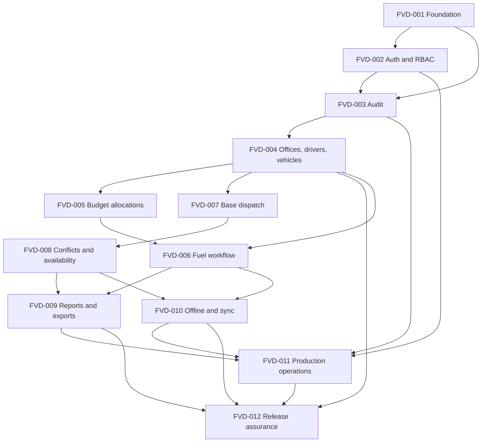

# Ticket Breakdown — Fuel and Vehicle Dispatch Management System

## Epic summary

Build a secure, LAN-only LGU system for fuel accounting, vehicle dispatch, administration, audit, reporting, and offline-tolerant drafting. The system uses a modular Next.js monolith, MySQL, Clean Architecture, transactional workflows, and a Docker Compose deployment on Ubuntu Server.

This is a greenfield project. The Product Requirements Document is the product epic, while `docs/System_Architecture.md` supplies the binding architecture and security decisions.

## Slicing principles

- Each ticket delivers one testable vertical concern with its own API, application logic, persistence, and tests where applicable.
- Foundation work is limited to capabilities required by later vertical slices.
- Sensitive workflows include authorization, audit capture, and object-level access checks in the ticket that introduces them.
- Dependent tickets should be planned only after their prerequisites are implemented.
- P0 release blockers belong in the first ticket that needs them. They are not deferred to a final hardening phase.
- Every UI-bearing ticket must use the `ui-ux-pro-max` skill for design decisions and the `ui-styling` skill for shadcn/ui and Tailwind implementation.
- UI work follows `design-system/fuel-and-vehicle-dispatch-management-system/MASTER.md` unless a reviewed page-specific override exists.

## Tickets

### FVD-001 — Bootstrap the secure application and persistence foundation

**Scope**

Create the deployable Next.js modular monolith and establish the architectural boundaries used by every later slice. Add MySQL migrations, dependency wiring, shared error handling, request identifiers, structured logging, decimal handling, public identifiers, and the initial test harness.

**Acceptance criteria**

- The application starts locally through a development configuration and exposes a health endpoint.
- Domain and application code do not depend on Next.js, MySQL, or concrete repository implementations.
- Initial migrations create shared identity columns and migration metadata with rollback support.
- Protected resource conventions use opaque UUID or ULID public identifiers.
- API errors use the documented envelope and never expose stack traces, SQL, or secrets.
- Every request receives a request ID that appears in responses and structured logs.
- Financial helpers avoid JavaScript floating-point arithmetic.
- Unit and integration test projects run in continuous integration against MySQL.
- A minimal Docker Compose development stack starts the web application and database.
- The minimal root page follows the persisted design system and passes keyboard, focus, responsive, zoom, contrast, and reduced-motion checks.

**Per-ticket context**

- PRD: sections 1–4, NFR-003, NFR-007, NFR-008, NFR-013, and API Requirements.
- Architecture: sections 2–3, 6, 9–11, 15, 18, and Architecture Decision Summary.
- Seams: composition root, shared domain primitives, API response mapper, database migrations, repository interfaces.

**Estimated files and size**

- `package.json`, Next.js configuration, `src/domain/shared/**`, `src/application/shared/**`, `src/infrastructure/database/**`, `src/lib/**`, `src/app/api/health/**`, `tests/**`, and development Compose files.
- Rough size: 900–1,400 lines, including tests.

**Depends on:** none.

---

### FVD-002 — Deliver authentication, sessions, RBAC, and privileged account security

**Scope**

Implement browser authentication and server-side authorization as a complete security slice. Include users, roles, permissions, sessions, login throttling, password recovery, privileged TOTP multi-factor authentication, session revocation, and CSRF protection.

**Acceptance criteria**

- Users can log in and log out through secure cookie-based sessions.
- Passwords use Argon2id or an approved adaptive hash and never appear in responses or logs.
- State-changing routes reject missing or invalid Cross-Site Request Forgery tokens.
- Server-side permission checks protect routes and individual resources.
- Privileged roles must enroll and pass Time-based One-Time Password multi-factor authentication before production use.
- Idle timeout, absolute lifetime, and privileged concurrent-session limits are enforced.
- Password, role, and status changes revoke affected sessions.
- Login throttling and lockout controls resist brute-force attempts.
- Admin-assisted password reset works without external email and records the acting administrator.
- Deleted or inactive users cannot authenticate.
- Authorization bypass, privilege escalation, session invalidation, and CSRF tests pass.

**Per-ticket context**

- PRD: personas, FR-MGMT-005, NFR-001, NFR-011 through NFR-015, and API Security Baseline.
- Architecture: sections 7–10, 15–16, and evaluation findings SEC-03, SEC-04, SEC-05, SEC-07, and SEC-10.
- Seams: `src/domain/user`, `src/application/auth`, `src/infrastructure/auth`, `src/lib/auth`, and `/api/auth`.

**Estimated files and size**

- Authentication domain and use cases, RBAC policies, user/session repositories, auth route handlers, login and reset pages, migrations, and security tests.
- Rough size: 1,200–1,800 lines, including tests. Split during planning if the selected auth library requires substantial adapter work.

**Depends on:** FVD-001.

---

### FVD-003 — Establish durable immutable audit capture and verification

**Scope**

Create the mandatory audit subsystem before operational modules. Provide synchronous durable capture through an outbox, asynchronous hash chaining, read-only audit queries, and verification against a write-restricted secondary sink adapter.

**Acceptance criteria**

- Application services can append audit events within the same transaction as a business change.
- A business request is not acknowledged until its audit event is durably stored locally.
- Normal application paths cannot update or delete audit records.
- A worker builds the SHA-256 hash chain from canonical event payloads.
- The writer supports a separate append-only sink through an interface and dedicated credentials.
- A verification job detects missing, changed, reordered, or mismatched records.
- Authorized auditors can search audit events through a paginated, read-only API and page.
- Failed authorization attempts and authentication events can use the same audit contract.
- Audit data access is permission-controlled and audited.
- Integration tests prove transaction rollback, append-only behavior, chaining, and tamper detection.

**Per-ticket context**

- PRD: FR-AUDIT-001, NFR-002, NFR-013, NFR-016, and audit success indicators.
- Architecture: sections 7, 12, 15–16, 18–19, and evaluation finding SEC-01.
- Seams: audit event port used by every application service, transactional outbox, worker, sink adapter, and verification job.

**Estimated files and size**

- `src/domain/audit/**`, `src/application/audit/**`, `src/infrastructure/audit/**`, worker code, audit routes/pages, migrations, and tests.
- Rough size: 1,100–1,600 lines, including tests.

**Depends on:** FVD-001 and FVD-002.

---

### FVD-004 — Manage offices, drivers, and vehicles with safe lifecycle rules

**Scope**

Deliver the master-data workflows needed by fuel and dispatch. Include office, driver, and vehicle creation, editing, status changes, soft deletion, restoration, selectors, permissions, and audit events.

**Acceptance criteria**

- Authorized users can list, create, update, soft-delete, and restore offices, drivers, and vehicles.
- Office names, office abbreviations, and vehicle plate numbers remain unique under concurrent requests.
- Soft deletion requires an actor and reason and never physically removes a record.
- Default lists and operational selectors exclude soft-deleted records.
- Historical lookups can resolve deleted records through explicit repository methods.
- Vehicle serviceability and driver activity are represented as domain state.
- Status changes, deletion, and restoration produce immutable audit events.
- Collection endpoints paginate with a server-side maximum of 200 records.
- Pages provide filtering, accessible forms, confirmation dialogs, and clear status indicators.
- Repository, authorization, validation, and end-to-end lifecycle tests pass.

**Per-ticket context**

- PRD: FR-MGMT-002 through FR-MGMT-004, FR-ADMIN-010, NFR-004, and UI requirements.
- Architecture: sections 3–6, 8–11, Soft Delete Repository Contract, 16–18, and P2 pagination guidance.
- Seams: `office`, `driver`, and `vehicle` modules; explicit soft-delete repository contracts; common administrative UI.

**Estimated files and size**

- Domain modules, use cases, repositories, API routes, dashboard pages/forms/tables, migrations, and tests.
- Rough size: 1,300–1,900 lines, including tests. The three similar resources should share presentation primitives, not a generic domain model.

**Depends on:** FVD-003.

---

### FVD-005 — Manage budget allocations and fiscal eligibility

**Scope**

Implement office-linked PPMP budget allocations. Include lifecycle state, quarter and fiscal-year validation, soft deletion, restoration, operational selection rules, authorization, and auditing.

**Acceptance criteria**

- Authorized budget staff can list, create, update, close, cancel, soft-delete, and restore allocations.
- Quarter accepts only values from one through four.
- The PPMP, office, quarter, and fiscal-year tuple is unique.
- Only eligible active allocations appear in fuel transaction selectors.
- Historical records continue resolving closed or deleted allocations.
- Fiscal-period rules live behind a policy interface that can be changed without rewriting controllers.
- Every sensitive allocation change creates an immutable audit event.
- API, UI, repository, concurrency, authorization, and policy tests pass.

**Per-ticket context**

- PRD: FR-MGMT-001, FR-ADMIN-010, objective 4, and budget reporting requirements.
- Architecture: sections 3–6, 8–12, and Soft Delete Repository Contract.
- Seams: `src/domain/budget`, budget application use cases, office repository dependency, and budget dashboard/API.

**Estimated files and size**

- Budget domain, use cases, repositories, migrations, routes, pages, and tests.
- Rough size: 700–1,100 lines, including tests.

**Depends on:** FVD-003 and FVD-004.

---

### FVD-006 — Record, post, balance, and void fuel issuances atomically

**Scope**

Deliver the complete fuel workflow. Include draft entry, full-tank handling, transactional RIS generation, decimal total calculation, ledger posting, balance queries, void compensation, authorization, auditing, and user interfaces.

**Acceptance criteria**

- Authorized users can create and review draft fuel records using active master data.
- Destination defaults to `AOR`, and the client cannot set the RIS number or authoritative total.
- Posting locks and advances the monthly sequence without duplicate RIS numbers under concurrency.
- RIS numbers follow `YYYY-MM-XXX` and reset each month.
- Full-tank records cannot post until positive actual issued liters are supplied.
- Total amount uses decimal arithmetic from issued liters and the transaction unit price.
- Posting validates driver, vehicle, budget allocation, and fuel data inside one database transaction.
- Each posted issuance creates exactly one corresponding immutable issuance ledger entry and audit event.
- Balance queries reconcile opening, receipt, adjustment, and issuance entries by fuel type and period.
- Authorized voiding requires a reason, preserves the original record, and adds compensating ledger entries.
- Ledger entries cannot be edited or deleted through repositories or APIs.
- Concurrency, rollback, calculation, full-tank, ledger, void, authorization, and end-to-end tests pass.

**Per-ticket context**

- PRD: FR-FUEL-001 through FR-FUEL-008 and fuel success indicators.
- Architecture: sections 4.1, 4.4, 5.1–5.4, 6, 8–13, and fuel testing requirements.
- Seams: `FuelIssuance` aggregate, fuel ledger, monthly sequence repository, posting transaction, and fuel dashboard/API.

**Estimated files and size**

- Fuel domain, commands and queries, repositories, migrations, routes, forms/tables/balance views, and tests.
- Rough size: 1,500–2,200 lines, including tests. During planning, split draft management from posting only if the implementation cannot remain reviewable as one workflow.

**Depends on:** FVD-004 and FVD-005.

---

### FVD-007 — Dispatch vehicles with eligibility, lifecycle, and odometer controls

**Scope**

Deliver the base dispatch workflow without conflict overrides. Include draft creation, dispatching, completion, cancellation, driver and vehicle eligibility, odometer invariants, permissions, audit events, and user interfaces.

**Acceptance criteria**

- Authorized dispatch staff can create, view, edit, dispatch, complete, and cancel dispatch records.
- Only active drivers and serviceable vehicles can enter new standard dispatches.
- State transitions follow the documented dispatch state machine.
- Odometer values cannot be negative, and the final value cannot be below the initial value.
- Completion requires a valid final odometer and exposes derived distance.
- Completion performs state validation, required locking, persistence, and audit capture atomically.
- Cancelled and completed dispatches remain immutable historical records.
- Object-level authorization protects every dispatch operation and detail view.
- API, domain state-machine, repository, transaction, authorization, and end-to-end tests pass.

**Per-ticket context**

- PRD: FR-DISPATCH-001 through the first FR-DISPATCH-005 state requirement, FR-ADMIN-010, and dispatch UI requirements.
- Architecture: sections 4.2, 5.5–5.7, 6, 8–13, and Completing Dispatch.
- Seams: `VehicleDispatch` aggregate, dispatch lifecycle services, vehicle/driver repositories, and dispatch dashboard/API.

**Estimated files and size**

- Dispatch domain, use cases, repositories, migrations, routes, pages/forms/tables, and tests.
- Rough size: 1,200–1,800 lines, including tests.

**Depends on:** FVD-004.

---

### FVD-008 — Detect dispatch conflicts and show driver and vehicle availability

**Scope**

Extend dispatch scheduling with server-authoritative conflict detection, configurable policies, acknowledged overrides, concurrency protection, schedule APIs, calendars, and inline availability guidance.

**Acceptance criteria**

- Creating or rescheduling a dispatch checks conflicts for both driver and vehicle.
- Same-day matching works initially, while optional start and end timestamps support later interval scheduling.
- Conflict results identify the conflicting dispatch and whether the driver, vehicle, or both conflict.
- `BLOCK` always rejects conflicts, while `WARN_AND_ACK` requires permission, confirmation, and a reason.
- The final transaction re-checks conflicts and prevents concurrent unacknowledged double booking.
- Accepted overrides create operational acknowledgment records and immutable audit events.
- Day, week, and month schedule views exist for drivers and vehicles.
- Schedule views filter by office, driver, vehicle, and status.
- The dispatch form shows advisory availability and conflict details before submission.
- The server rejects attempts to bypass the override workflow through edited payloads.
- Domain, concurrency, authorization, API, and end-to-end conflict tests pass.

**Per-ticket context**

- PRD: schedule-conflict FR-DISPATCH-005 through FR-DISPATCH-008 and related security tests.
- Architecture: sections 4.2, 6, 9 Dispatch Scheduling Use Cases, 12, and schedule testing requirements.
- Seams: `CheckDispatchScheduleAvailability`, schedule query services, conflict policy, override repository, and calendar UI.

**Estimated files and size**

- Dispatch extensions, conflict policy/use cases, override migration/repository, schedule routes, calendar components, and tests.
- Rough size: 1,100–1,700 lines, including tests.

**Depends on:** FVD-007.

---

### FVD-009 — Provide operational reports and secure Excel exports

**Scope**

Deliver report queries, dashboard summaries, synchronous small exports, queued large exports, private file delivery, spreadsheet injection protection, authorization, and audit coverage.

**Acceptance criteria**

- Users can filter fuel and dispatch reports by office, date range, and supported period.
- Summary reports cover every initial report listed in the Product Requirements Document.
- Historical reports use stored transaction quantities and prices.
- XLSX files include headings, filters, totals, period details, and generation time.
- User-controlled cells beginning with `=`, `+`, `-`, or `@` are emitted as safe text.
- Small exports run synchronously below a configured threshold.
- Large exports create `export_jobs`, run in a worker, and read from a snapshot or reporting adapter.
- Generated files remain private and require reauthorization through short-lived download links.
- Export generation, completion, failure, and download create audit events.
- Report queries and jobs have bounded page, memory, time, and resource use.
- Query correctness, formula-injection, permissions, job lifecycle, and download tests pass.

**Per-ticket context**

- PRD: FR-REPORT-001 through FR-REPORT-003, Reporting Requirements, NFR-004, and NFR-017.
- Architecture: sections 6, 14–16, 18–19, SEC-02, SCALE-04, and SCALE-05.
- Seams: reporting query services, exporter interface, job queue, private storage adapter, and reports dashboard/API.

**Estimated files and size**

- Report use cases/queries, exporter, jobs and worker, storage adapter, migrations, routes, dashboard pages, and tests.
- Rough size: 1,300–1,900 lines, including tests.

**Depends on:** FVD-006 and FVD-008.

---

### FVD-010 — Add offline-tolerant drafts and idempotent synchronization

**Scope**

Add the progressive web application shell, safe reference caching, IndexedDB draft storage, a bounded mutation queue, idempotent server synchronization, explicit conflict handling, and user-visible connectivity states.

**Acceptance criteria**

- The application shell loads during a brief network interruption after an initial online visit.
- Users can save fuel and dispatch drafts offline without presenting them as official transactions.
- Only approved, non-sensitive reference data is cached.
- Passwords, session tokens, and full operational datasets never enter public Cache Storage or `localStorage`.
- Every queued operation includes an operation UUID, offline timestamp, entity type, payload, and schema version.
- The server processes each operation UUID at most once and returns the earlier result on safe retries.
- Queue states include queued, syncing, synced, conflict, and failed.
- Sync revalidates authentication, authorization, master-data eligibility, and dispatch conflicts.
- Batch size, body size, rate, and queue capacity limits are enforced with visible backpressure.
- Users can inspect and resolve conflicts; the client never silently overwrites server records.
- Offline, retry, duplicate-operation, capacity, authorization-expiry, and conflict tests pass.

**Per-ticket context**

- PRD: objectives 8 and 10, NFR-005, NFR-018, Offline Requirements, and Offline Indicator.
- Architecture: sections 3, 7, 13, 15–18, SEC-11, and offline P2 guidance.
- Seams: service worker, IndexedDB repositories, sync state machine, `sync_operations`, and `/api/sync/operations`.

**Estimated files and size**

- Offline queue/storage/sync modules, service worker configuration, sync API/use cases/repository, UI indicators, migrations, and tests.
- Rough size: 1,200–1,800 lines, including tests.

**Depends on:** FVD-006 and FVD-008.

---

### FVD-011 — Productionize Ubuntu and Docker Compose operations

**Scope**

Create the production container topology and command-line operations package. Include internal TLS termination, private networks, secrets, health checks, resource limits, backup and restore, migrations, rollback, monitoring, log rotation, and disaster-recovery documentation.

**Acceptance criteria**

- Pinned production images build reproducibly and run as non-root where practical.
- Docker Compose exposes only the reverse proxy to approved LAN networks.
- MySQL and Redis remain private to approved application or data networks.
- Internal Transport Layer Security works with an LGU-managed certificate authority.
- Secrets stay outside images and source control and have documented rotation steps.
- Services define health checks, restart policies, resource limits, persistent storage, and log rotation.
- The Docker socket and broad host mounts are unavailable to application containers.
- Command-line runbooks cover first deploy, migration, rollback, health checks, backup, restore, and updates.
- An automated encrypted database backup can be restored into a clean test environment.
- Documentation states the single-server failure limitation and describes the optional second-host topology.
- Audit sink, reporting, time synchronization, disk monitoring, firewall, and recovery checks appear in the operations checklist.
- A production-like smoke test proves login, one transaction, one audit event, one job, backup, and restore.

**Per-ticket context**

- PRD: Deployment Environment, FR-DEPLOY-001 through FR-DEPLOY-005, NFR-009, NFR-010, NFR-010A, and NFR-019.
- Architecture: sections 16, 19, 21, and evaluation findings SEC-09, SCALE-06, and cost guidance.
- Seams: production Compose files, reverse proxy, worker, MySQL, Redis, private storage, backup scripts, and CLI runbooks.

**Estimated files and size**

- Dockerfiles, Compose manifests, reverse-proxy configuration, environment templates, operational scripts, runbooks, and smoke tests.
- Rough size: 800–1,300 lines, including tests and documentation.

**Depends on:** FVD-002, FVD-003, FVD-009, and FVD-010.

---

### FVD-012 — Complete privacy, retention, accessibility, and release assurance

**Scope**

Close cross-cutting release requirements after all product workflows exist. Define retention and disposal, protect personal data and uploads, verify accessibility, run security and recovery exercises, and produce release evidence.

**Acceptance criteria**

- A documented RA 10173-aligned classification covers driver contacts, IP addresses, audit snapshots, exports, backups, and sync data.
- Retention and archival periods exist for every data class named by the architecture.
- Automated jobs enforce approved retention without deleting immutable ledger or required audit evidence.
- Avatar uploads enforce type, size, inspection or re-encoding, opaque names, private storage, and non-executable delivery.
- Core workflows pass keyboard, focus, labeling, contrast, and error-message checks.
- Security testing covers authorization bypass, injection, Cross-Site Request Forgery, rate limiting, session controls, uploads, audit integrity, and offline abuse.
- Dependency findings follow a documented triage and remediation service-level agreement.
- Secret rotation, backup restoration, audit verification, and incident recovery exercises are recorded.
- User acceptance testing traces every initial-release requirement to automated or documented evidence.
- No P0 or P1 architecture finding remains open at release approval.

**Per-ticket context**

- PRD: NFR-001 through NFR-019, Accessibility, Data Privacy, Upload Security, and all initial-release acceptance criteria.
- Architecture: sections 7, 13–20, Evaluation Report Integration, and Data Retention.
- Seams: retention jobs, upload adapter and user profile UI, accessibility tests, security suite, and release evidence.

**Estimated files and size**

- Policies and runbooks, retention jobs, avatar upload flow, accessibility/security tests, and release traceability documents.
- Rough size: 900–1,500 lines, including tests and documentation.

**Depends on:** FVD-004, FVD-009, FVD-010, and FVD-011.

## Dependency graph

## Parallel work groups

- FVD-001 is the sole foundation ticket.
- FVD-002 begins after FVD-001. FVD-003 needs the identity model and permission seams from FVD-002.
- FVD-004 begins after immutable auditing is usable.
- FVD-005 and FVD-007 can run in parallel after FVD-004. They occupy separate budget and dispatch modules.
- FVD-006 waits for FVD-005 and uses the master data from FVD-004.
- FVD-008 waits for the base dispatch workflow in FVD-007. It can run in parallel with FVD-006.
- FVD-009 and FVD-010 both wait for fuel and conflict-aware dispatch behavior. Once those prerequisites land, they can run in parallel.
- FVD-011 waits for the production service topology to be known through reporting and synchronization.
- FVD-012 is the final release assurance ticket. Its retention and upload subtasks may start earlier, but final proof waits for FVD-011.

## Suggested execution order

1. **Wave 1:** FVD-001.
2. **Wave 2:** FVD-002.
3. **Wave 3:** FVD-003.
4. **Wave 4:** FVD-004.
5. **Wave 5, parallel:** FVD-005 and FVD-007.
6. **Wave 6, parallel:** FVD-006 and FVD-008.
7. **Wave 7, parallel:** FVD-009 and FVD-010.
8. **Wave 8:** FVD-011.
9. **Wave 9:** FVD-012.

## Planning handoff

Start FVD-001 with `/piv-plan-implementation`. Plan later tickets just-in-time after their dependencies are implemented. Update each later ticket's estimated files during planning because the greenfield foundation will establish the actual naming and module conventions.
